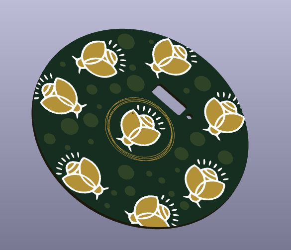

# Firefly Night-Light
#### February, 13, 2025
 - Development REPO for a nightlight project using the AT-TINY1614 MCU and addressable LED strips### About
## Features 
 - PCB is designed to replace a standard wide-mouth Mason jar and have LED strips hanging from it resembling a jar full of fireflies
 - Top copper pad acts as a touch button to toggle the nightlight on/off and adjust brightness. Shake the jar for a firefly lightshow
 - Onboard LI-PO battery that is USB-C re-chargeable

